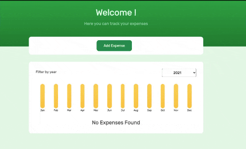

# expense-tracker-app

• I built a single-page **expense-list tracker** app with Reactjs.

• It allows for adding expenses and filter them by year, also provide a graph for easier understanding for total expenses.

Live preview : https://expense-tracker-furkanarabul.vercel.app/



## Project setup

```
npm install
```

```
yarn install
```

### Compiles and hot-reloads for development

```
npm run start
```

```
yarn start
```
